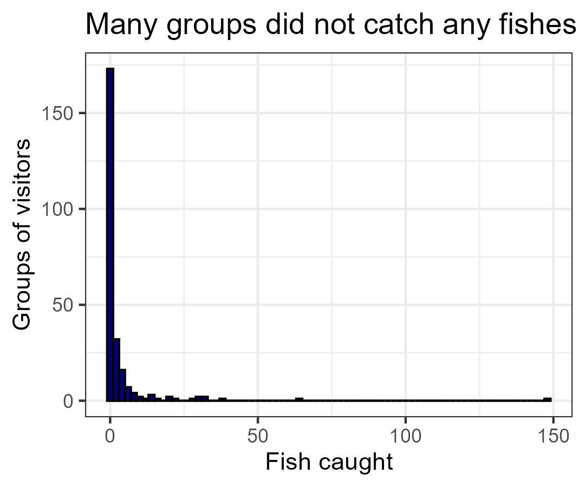
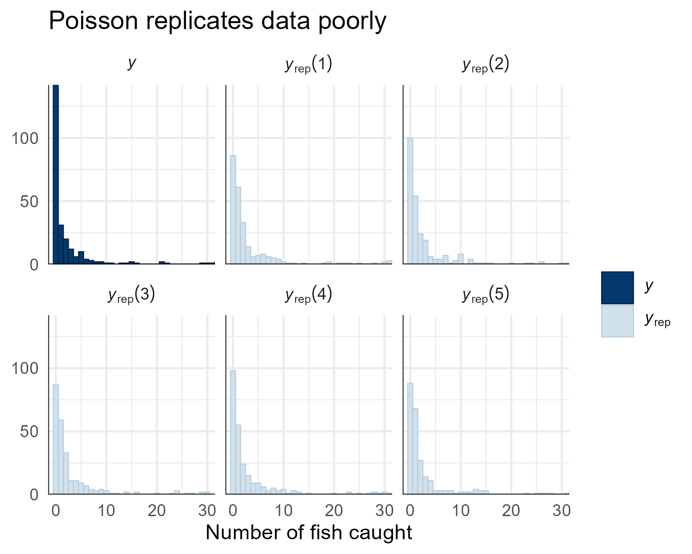
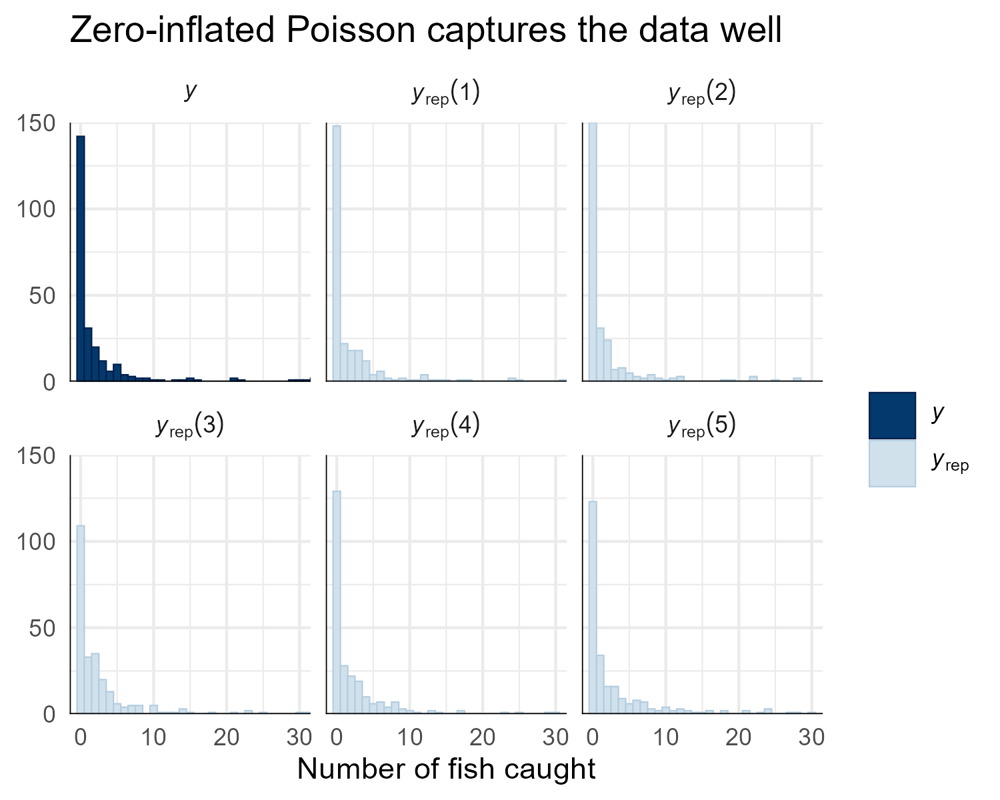
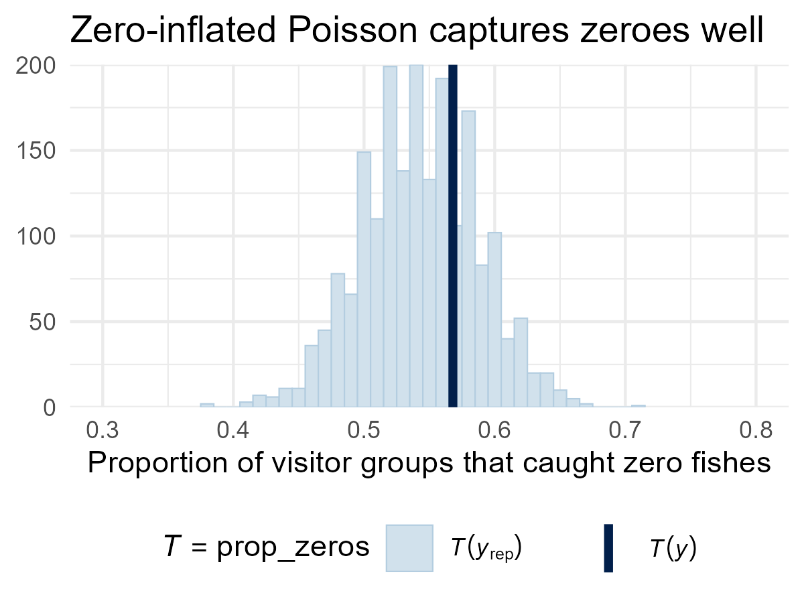
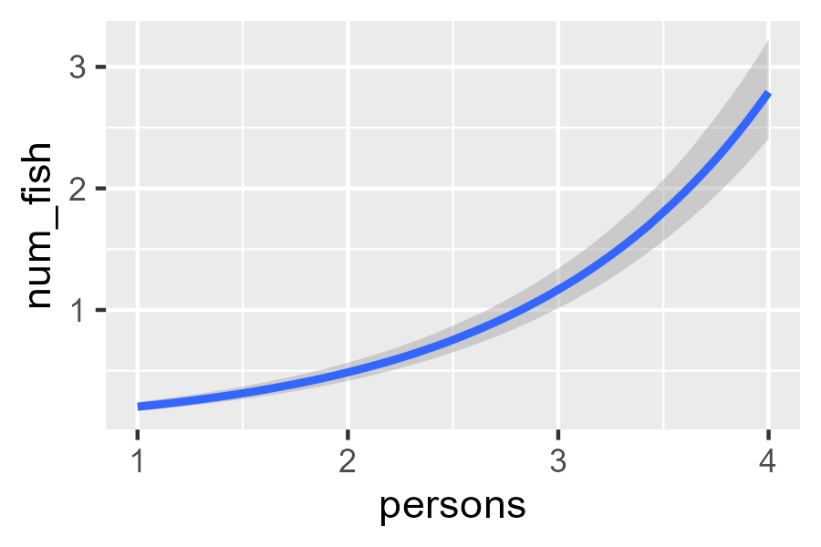
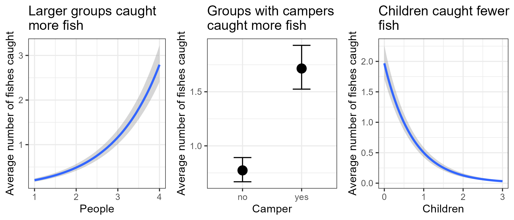

# Flexible GLMs

```{r Load libraries}
#| code-summary: "Load libraries"
#| code-fold: true
#| eval: true
#| output: false
library(dplyr)
library(ggplot2)
library(brms)
library(tidybayes)
library(bayesplot)
library(gridExtra)
options(brms.backend = "cmdstanr")
```

Now that we can write `brms` models and read their output, we can brave more
complicated models[^orig-pois]. Let us consider some data from park visitors, gathered by UCLA. In
their words:

> The state wildlife biologists want to model how many fish are
being caught by fishermen at a state park. Visitors are asked whether or not
they have a camper, how many people were in the group, were there children in
the group and how many fish were caught. Some visitors do not fish, but there
is no data on whether a person fished or not. Some visitors who did fish did
not catch any fish [...][^ucla-data]

[^orig-pois]: This data analysis is adapted from @burkner2025distmods.

[^ucla-data]: From @ucla2026zinf. It is unclear if the data are real or
simulated.

These data describe 250 groups of park visitors. For each group, we know how
many fish they caught (`count`), how many total people were in the group
(`persons`), how many of these were children (`child`), and whether the group
brought a camper vehicle (`camper`).

```{r Prepare fisher data}
#| eval: true
fisher_df <- read.csv("https://paul-buerkner.github.io/data/fish.csv")
fisher_df <- fisher_df[, c("persons", "child", "camper", "count")]
names(fisher_df)[names(fisher_df) == "count"] <- "num_fish"
fisher_df <- fisher_df |>
  mutate(camper = as.factor(if_else(camper == 0, true = "no", false = "yes")))
summary(fisher_df)
```

Note that many visitor groups caught zero fishes (see histogram below). These include zeroes from visitors that did not fish at all and zeroes from visitors that did fish but caught nothing.

```{r histogram of fishes caught}
#| code-fold: true
#| warning: false
#| fig-align: center
#| fig-width: 3.6
#| fig-height: 3
ggplot(data = fisher_df, mapping = aes(x = num_fish)) +
  geom_histogram(binwidth = 2, color = "black", fill = "navyblue") +
  labs(
    title = "Many groups did not catch any fishes",
    x = "Fish caught",
    y = "Groups of visitors"
  ) +
  theme_bw()
```

[{#fig-fish-hist fig-align="center" width=3.6in}](./images/fish-hist.png)

It is reasonable to think that larger groups were more likely to catch more
fish. Also, groups with campers likely stayed longer at the park, which would
give them more time to fish. And children dislike sitting in silence for long
periods, so groups with more children may have fished less.

These ideas suggest using a model that can associate the average number of
caught fish to `persons`, `child`, and `camper`. We should also use a model
that accounts for the fact that the number of fishes caught is a non-negative
integer. A Poisson regression is a relatively simple model that can fulfil both
of these requirements[^poisson-fish].

[^poisson-fish]: ...and gets extra credit because "poisson" means "fish" in french.

The code to fit this regression is shown below. The only novelty
here is the argument `family`, which controls the type of model we want to
fit---in this case, a `poisson()`.

```{r fit poisson}
fit_fisher1 <- brm(
  formula = num_fish ~ persons + child + camper,
  data = fisher_df,
  family = poisson(),
  chains = 4,
  cores = 4,
  iter = 1000,
  warmup = 500
)
```

Once again, our ESS and R-hats are all acceptable:

```{r summary fit_fisher1}
summary(fit_fisher1)
```

```
 Family: poisson
  Links: mu = log
Formula: num_fish ~ persons + child + camper
   Data: fisher_df (Number of observations: 250)
  Draws: 4 chains, each with iter = 1000; warmup = 500; thin = 1;
         total post-warmup draws = 2000

Regression Coefficients:
          Estimate Est.Error l-95% CI u-95% CI Rhat Bulk_ESS Tail_ESS
Intercept    -1.99      0.15    -2.29    -1.70 1.00     1351     1399
persons       1.09      0.04     1.02     1.17 1.00     1414     1287
child        -1.69      0.08    -1.86    -1.54 1.00     1234     1252
camperyes     0.93      0.09     0.75     1.11 1.00     1528     1339

Draws were sampled using sample(hmc). For each parameter, Bulk_ESS
and Tail_ESS are effective sample size measures, and Rhat is the potential
scale reduction factor on split chains (at convergence, Rhat = 1).
```

Before we examine the coefficients, we can check if our model can replicate the
overall pattern of fish caught. The function `pp_check()` offers many types of
plots to check how well our model fits the data. It asks us to define a model
to evaluate and the
`type` of evaluation we want. `type = "hist"` compares the histogram of the
original data (shown as $y$ in navy blue) to the histograms obtained from the random
draws in our model (shown as $y_{rep}$ in light blue). In this case, `ndraws` controls how
many randomly chosen histograms to include in the plot.

```{r check fit of fit_fisher1}
#| fig-align: center
#| fig-width: 5
#| fig-height: 4
pp_check(object = fit_fisher1, type = "hist", ndraws = 5, binwidth = 1) +
  coord_cartesian(xlim = c(0, 30)) +
  labs(
    title = "Poisson replicates data poorly",
    x = "Number of fish caught"
  ) +
  theme_minimal()
```

[{#fig-fisher1-pred fig-align="center" width=5in}](./images/fisher1-pred.png)

The histograms above suggest that our model is predicting too many visitors
with 1, 2, and 3 fishes and too few visitors with zero fishes. This suggests that, unfortunately, our current Poisson regression cannot account for these many zeroes, and in trying to do so it is distorting our inferences.

## Handling excess zeroes

Fortunately, `brms` can expand our model so it directly estimates the proportion of groups that did not fish at all. This expanded model is called "zero-inflated Poisson regression" because it inflates (i.e., adds more) zeroes to the basic Poisson regression. For now, we presume that all groups had the same chance of going fishing. The code to fit this zero-inflated regression is almost the same as before; the only change is that we now set the family to `zero_inflated_poisson()`.

```{r fit zero inf poisson}
fit_fisher_zinf <- brm(
  formula = num_fish ~ persons + child + camper,
  data = fisher_df,
  family = zero_inflated_poisson(),
  chains = 4,
  cores = 4,
  iter = 1000,
  warmup = 500
)
```

Let's see if our ingenuous use of zero inflation paid off. First, it seems that our zero-inflated Poisson replicates well the overall pattern of fishes caught (see figure below).

```{r check fit of fit_fisher_zinf}
#| fig-align: center
#| fig-width: 5
#| fig-height: 4
pp_check(object = fit_fisher_zinf, type = "hist", ndraws = 5, binwidth = 1) +
  coord_cartesian(xlim = c(0, 30)) +
  labs(
    title = "Zero-inflated Poisson captures the data well",
    x = "Number of fish caught"
  ) +
    theme_minimal()
```

[{#fig-fisher-zinf-pred fig-align="center" width=5in}](./images/fisher-zinf-pred.png)

We can also inspect the inspect the proportion of visitors with zero fishes by calling `pp_check()` again. The code is similar to the one above, but we
now use `type = "stat"` and add a custom function to compute the proportion
of zeroes in a vector:

```{r check prop of zeroes in fit_fisher_zinf}
#| fig-align: center
#| fig-width: 4
#| fig-height: 3
# Define a function that computes the proportion of zeroes
prop_zeros <- function(y) mean(y == 0)
pp_check(
  object = fit_fisher_zinf,
  type = "stat",
  stat = "prop_zeros",
  binwidth = 0.01
) +
  labs(
    title = "Zero-inflated Poisson captures zeroes well",
    x = "Proportion of visitor groups that caught zero fishes"
  ) +
    coord_cartesian(xlim = c(0.3, 0.8)) +
    theme_minimal() +
    theme(legend.position = "bottom")
```

[{#fig-fisher-zinf-zeroes fig-align="center" width=3.6in}](./images/fisher-zinf-zeroes.png)

The figure above compares the observed proportion of zeroes (shown in navy blue) to
the proportions predicted based on our model's random draws (shown in light blue). As this histogram
shows, our zero-inflated poisson accurately predicts the proportion of zeroes.

## Interpreting Poisson

Now we can examine the coefficients from our more accurate zero-inflated Poisson regression. To flaunt the flexibility of `brms`'s output, we switch
the width of the credibility intervals to 80%:

```{r summary zero inf poisson}
summary(fit_fisher_zinf, prob = 0.8)
```

```
 Family: zero_inflated_poisson
  Links: mu = log
Formula: num_fish ~ persons + child + camper
   Data: fisher_df (Number of observations: 250)
  Draws: 4 chains, each with iter = 1000; warmup = 500; thin = 1;
         total post-warmup draws = 2000

Regression Coefficients:
          Estimate Est.Error l-80% CI u-80% CI Rhat Bulk_ESS Tail_ESS
Intercept    -1.01      0.18    -1.24    -0.79 1.00      986     1173
persons       0.87      0.05     0.82     0.93 1.00     1113     1488
child        -1.37      0.10    -1.49    -1.25 1.00     1101     1277
camperyes     0.80      0.10     0.68     0.92 1.00     1408     1116

Further Distributional Parameters:
   Estimate Est.Error l-80% CI u-80% CI Rhat Bulk_ESS Tail_ESS
zi     0.41      0.05     0.35     0.47 1.00     1423     1407
```

For mathy reasons, the regression coefficients are in the natural logarithm
scale, which complicates their interpretation. So, instead of deciphering the table, we can call `conditional_effects()` to plot the modeled associations between each variable and the average number of fish. The plots below show the medians and **80%** credibility intervals of the posterior distributions of
average fish at each value of the corresponding independent variable. When a variable is *not* shown in a plot, we are fixing its value at either its average (for continuous variables) or its reference category (for categorical variables).

We start by visualizing the association between average fishes caught and the
number of people in a group:

```{r persons effect plot}
#| warning: false
#| fig-align: center
#| fig-width: 3.5
#| fig-height: 3
conditional_effects(
    x = fit_fisher_zinf,
    method = "posterior_epred",
    effect = "persons",
    prob = 0.8 # For 80% credibility intervals
  )
```

[{#fig-zinf-person-eff fig-align="center" width=3in}](./images/zinf-person-eff.png)

The main lesson from this plot is that groups of visitors with more people
caught more fish on average, but the difference was not big. With some effort,
we can use `ggplot` to embelish this plot. We do the same for the associations
of children and camper.

```{r plot conditional effects}
#| code-fold: true
#| warning: false
#| fig-align: center
#| fig-width: 7
#| fig-height: 3
# Number of people
person_assoc <- plot(
  conditional_effects(
    x = fit_fisher_zinf,
    method = "posterior_epred",
    effect = "persons",
    prob = 0.8
  ),
  plot = FALSE
)[[1]] +
  labs(
    title = "Larger groups caught\nmore fish",
    x = "People",
    y = "Average number of fishes caught"
  ) +
theme_bw()
# Children
child_assoc <- plot(
  conditional_effects(
    x = fit_fisher_zinf,
    method = "posterior_epred",
    effect = "child",
    prob = 0.8
  ),
  plot = FALSE
)[[1]] +
  labs(
    title = "Children caught fewer\nfish",
    x = "Children",
    y = "Average number of fishes caught"
  ) +
theme_bw()
# Camper
camper_assoc <- plot(
  conditional_effects(
    x = fit_fisher_zinf,
    method = "posterior_epred",
    effect = "camper",
    prob = 0.8
  ),
  plot = FALSE
)[[1]] +
  labs(
    title = "Groups with campers\ncaught more fish",
    x = "Camper",
    y = "Average number of fishes caught"
  ) +
theme_bw()
# Arrange these plots in a single row
grid.arrange(
  arrangeGrob(person_assoc, camper_assoc, child_assoc, ncol = 3),
  nrow = 1
)
```

[{#fig-cond-effs fig-align="center" width=7in}](./images/cond-effs.png)

Now let's review the part of summary that refers to the zero-inflation parameter:

```
Further Distributional Parameters:
   Estimate Est.Error l-80% CI u-80% CI Rhat Bulk_ESS Tail_ESS
zi     0.41      0.05     0.35     0.47 1.00     1423     1407
```

In general, the parameter `zi` (short for "zero inflation") represents the
probability of an observation being an *excess* zero. In our model, we can
interpret `zi` as the probability of *not* going fishing. With our current credibility criterion, this probability is estimated to be between 35% and 47%.