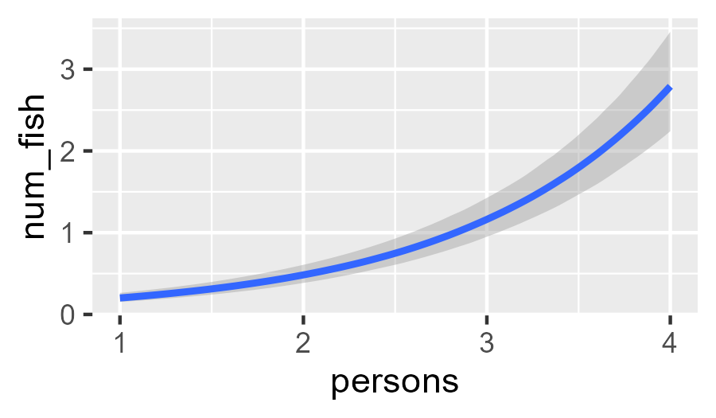
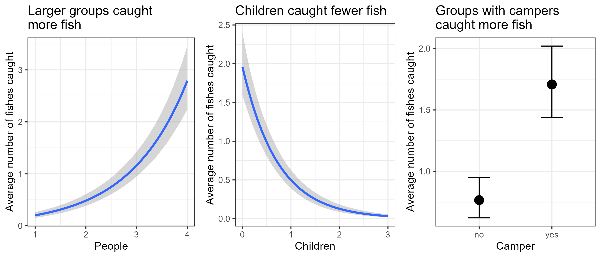

# Flexible GLMs

Now that we can write `brms` models and read their output, we can brave more
complicated models.

```{r Load libraries}
#| code-summary: "Load libraries"
#| code-fold: true
#| eval: true
#| output: false
library(dplyr)
library(ggplot2)
library(brms)
library(tidybayes)
library(bayesplot)
library(gridExtra)
options(brms.backend = "cmdstanr")
```

Let us consider some data from park visitors, gathered by UCLA[^orig-pois]. In
their words "the state wildlife biologists want to model how many fish are
being caught by fishermen at a state park. Visitors are asked whether or not
they have a camper, how many people were in the group, were there children in
the group and how many fish were caught. Some visitors do not fish, but there
is no data on whether a person fished or not. Some visitors who did fish did
not catch any fish [...]"[^ucla-data]

[^orig-pois]: This data analysis is adapted from Paul Bürkner's original,
available in <https://cran.r-project.org/web/packages/brms/vignettes/brms_distreg.html>.

[^ucla-data]: This description comes from <https://stats.oarc.ucla.edu/stata/dae/zero-inflated-poisson-regression/>, though it is unclear if the data are real
or simulated

These data describe 250 groups of park visitors. For each group, we know how
many fish they caught (`count`), how many total people were in the group
(`persons`), how many of these were children (`child`), and whether the group
brought a camper (`camper`).

```{r Prepare fisher data}
#| eval: true
fisher_df <- read.csv("https://paul-buerkner.github.io/data/fish.csv")
fisher_df <- fisher_df[, c("persons", "child", "camper", "count")]
names(fisher_df)[names(fisher_df) == "count"] <- "num_fish"
fisher_df <- fisher_df |>
  mutate(camper = as.factor(if_else(camper == 0, true = "no", false = "yes")))
summary(fisher_df)
```

It is reasonable to think that larger groups were more likely to catch more
fish. Also, groups with campers likely stayed longer at the park, which would
give them more time to fish. But children do not often like to sit silently
for long periods, so groups with more children may have fished less.

These ideas suggest using a model that can associate the average number of
caught fish to `persons`, `child`, and `camper`. We should also use a model
that accounts for the fact that the number of fishes caught is a non-negative
integer. A Poisson regression is a relatively simple model that can fulfil both
of these requirements.

Note, however, that many visitor groups caught zero fishes (see figure below).
These include zeroes from visitors that did not fish at all and zeroes from
visitors that did fish but caught nothing. Unfortunately, a regular Poisson
regression cannot account for these many zeroes, and ignoring them would
distort our inferences. Fortunately, with `brms` we can expand our model to be
able estimate the proportion of groups that did not fish at all. This expanded
model is called "zero-inflated Poisson regression" because it inflates (i.e.,
adds more) zeroes to the basic Poisson regression. For now, we presume that all
groups had the same chance of going fishing.

```{r histogram of fishes caught}
#| code-fold: true
#| eval: true
#| warning: false
#| fig-align: center
#| fig-width: 3.5
#| fig-height: 3
ggplot(data = fisher_df, mapping = aes(x = num_fish)) +
  geom_histogram(binwidth = 2, color = "black", fill = "navyblue") +
  labs(
    title = "Many groups did not catch any fish",
    x = "Fish caught",
    y = "Groups of visitors"
  ) +
  theme_bw()
```

The code to fit this zero-inflated regression is shown below. The only novelty
here is the argument `family`, which controls the type of model we want to
fit---in this case, a `zero_inflated_poisson()`.

```{r fit zero inf poisson}
fit_fisher1 <- brm(
  formula = num_fish ~ persons + child + camper,
  data = fisher_df,
  family = zero_inflated_poisson(),
  chains = 4,
  cores = 4,
  iter = 1000,
  warmup = 500
)
```


Once again, our ESS and R-hats are all acceptable:

```{r summary fit_fisher1}
summary(fit_fisher1)
```

For mathy reasons, the regression coefficients are in the natural logarithm
scale, which complicates their interpretation. Instead, we can use
`conditional_effects()` to plot the modeled associations between each variable
and the average number of fish. The plots below show the medians and 95%
credibility intervals of the posterior distributions of fish at each value of
the corresponding independent variable. When a variable is *not* shown in a
plot, we are fixing its value at either its average (for continuous variables)
or its reference category (for categorical variables).

We start by visualizing the association between average fishes caught and the
number of people in a group:

```{r persons effect plot}
#| warning: false
#| fig-align: center
#| fig-width: 3.5
#| fig-height: 3
conditional_effects(
    x = fit_fisher1,
    method = "posterior_epred",
    effect = "persons"
  )
```
{#fig-pers-eff fig-align="center" width=300}

The main lesson from this plot is that groups of visitors with more people
caught more fish on average, but the difference was not big. With some effort,
we can use `ggplot` to embelish this plot. We do the same for the associations
of children and camper.

```{r plot conditional effects}
#| code-fold: true
#| warning: false
#| fig-align: center
#| fig-width: 7
#| fig-height: 3
# Number of people
person_assoc <- plot(
  conditional_effects(
    x = fit_fisher1,
    method = "posterior_epred",
    effect = "persons"
  ),
  plot = FALSE
)[[1]] +
  labs(
    title = "Larger groups caught\nmore fish",
    x = "People",
    y = "Average number of fishes caught"
  ) +
theme_bw()
# Children
child_assoc <- plot(
  conditional_effects(
    x = fit_fisher1,
    method = "posterior_epred",
    effect = "child"
  ),
  plot = FALSE
)[[1]] +
  labs(
    title = "Children caught fewer\nfish",
    x = "Children",
    y = "Average number of fishes caught"
  ) +
theme_bw()
# Camper
camper_assoc <- plot(
  conditional_effects(
    x = fit_fisher1,
    method = "posterior_epred",
    effect = "camper"
  ),
  plot = FALSE
)[[1]] +
  labs(
    title = "Groups with campers\ncaught more fish",
    x = "Camper",
    y = "Average number of fishes caught"
  ) +
theme_bw()
# Arrange these plots in a single row
grid.arrange(
  arrangeGrob(person_assoc, child_assoc, camper_assoc, ncol = 3),
  nrow = 1
)
```

{#fig-cond-effs fig-align="center" width=600}

```{r}
tst = grid.arrange(
  arrangeGrob(person_assoc, child_assoc, camper_assoc, ncol = 3),
  nrow = 1
)
```

## Did inflating zeroes work?

Let's see if our ingenuous use of zero inflation paid off. First, let's review
the part of summary that refers to this expansion of the model:

```
Further Distributional Parameters:
   Estimate Est.Error l-95% CI u-95% CI Rhat Bulk_ESS Tail_ESS
zi     0.41      0.04     0.32     0.49 1.00     1463     1233
```

In general, the parameter `zi` (short for "zero inflation") represents the
probability of an observation being an *excess* zero. In our model, we can
interpret `zi` as the probability of *not* going fishing. This probability is
estimated to be between 32% and 49%.

Now we can check if our model can replicate the overall pattern of fish
caught. The function `pp_check()` offers many types of plots to check how well
our model fits the data. It asks us to define a model to evaluate and the
`type` of evaluation we want. `type = "hist"` compares the histogram of the
original data (shown in navy blue) to the histograms obtained from the random
draws in our model (shown in light blue). In this case, `ndraws` controls how
many randomly chosen histograms to include in the plot. The resulting plot
suggests that our zero-inflated Poisson replicates well the overall pattern of
fishes caught.

```{r check fit of fit_fisher1}
pp_check(object = fit_fisher1, type = "hist", ndraws = 5, binwidth = 2) +
  coord_cartesian(xlim = c(0, 50)) +
  labs(
    title = "Zero-inflated Poisson captures the data well",
    x = "Number of fish caught"
  ) +
    theme_minimal()
```


```{r}
# Define a function that computes the proportion of zeroes
prop_zeros <- function(y) mean(y == 0)
pp_check(
  object = fit_fisher1,
  type = "stat",
  stat = "prop_zeros",
  binwidth = 0.01
) +
  labs(
    title = "Proportion of zeroes is accurate",
    x = "Proportion of visitor groups that caught zero fishes"
  ) +
    theme_minimal() +
    theme(legend.position = "bottom")
```

Now the formula is split. One part informs the probability of going fishing.
The other part informs the expected number of fishes caught by visitors that
did go fishing.

$$
\begin{align*}
    y&: \text{Number of fish}\\
    y&\sim \text{Poisson}(\mu) \\
    \text{log}(\mu) &= \beta X \\
    \beta_j &\sim \mathrm{i.i.d.} \text{ Normal}(0, 1) \text{ for all } j
\end{align*}
$$