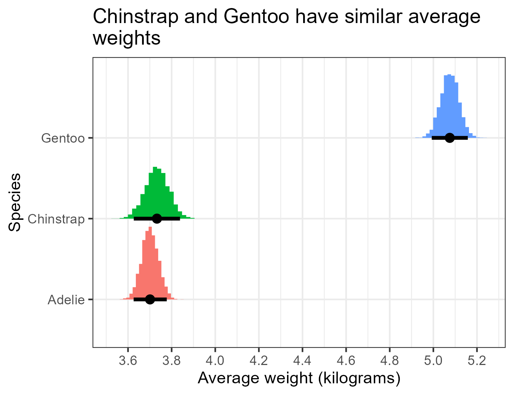

# Linear regression in brms

`brms` allows us to add or remove parts of a model as needed, so our code is
only as complicated as the model we want to fit. Simple code for simple
models; fancy code for fancy models.

Imagine, for example, that we like penguins and we want to study their weight.
R has some clean data about three types of chilly fellows: Adelie, Chinstrap,
and Gentoo.

```{r load penguin data}
#| eval: true
data(penguins)
penguins$body_mass_kilograms <- penguins$body_mass / 1000
```

To start, let us compare the weights of these three groups. The histogram
below suggests that Gentoo penguins tend to be the heaviest, while
Adelie and Chinstrap tend to have similar weights.

```{r visualize penguin weights}
#| code-fold: true
#| eval: true
#| warning: false
#| fig-align: center
#| fig-width: 4
#| fig-height: 4
library(ggplot2)
ggplot(penguins, mapping = aes(x = body_mass_kilograms)) +
    geom_histogram(binwidth = 0.2, color = "black", fill = "darkorange") +
    facet_wrap(~species, nrow = 3, ncol = 1) +
    labs(
    title = "Gentoo penguins are the heaviest",
    x = "Body mass (kilograms)",
    y = "Count"
    ) +
    theme_minimal()
```

We can complement this histogram with estimates for average weight of each
group of penguins. A linear regression can give us these estimates along with
their confidence intervals. We can fit this (and any other) regression in
`brms` using the function `brm()` (short for "bayesian regression model"),
which for our simple model requires only a formula to describe the regression
function and the name of the data set that houses the corresponding variables.

The code below shows how to fit a linear regression with weight (in kilograms)
as the dependent variable and species as the independent categorical variable
with values "Adelie", "Chinstrap", and "Gentoo". Run this code and ignore its lengthy output for now.

```{r simple model with brm}
library(brms)
options(brms.backend = "cmdstanr")
fit_peng1 <- brm(
    formula = body_mass_kilograms ~ species,
    data = penguins
)
```

The first time it sees a model, `brm()` *compiles* the code, i.e., it uses the
C++ toolchain to translate the code into efficient machinespeak. `brm()` does
not need to recompile unless we change something, so rerunning this same
regression will be much faster (try it!). Think of `brm()` as a virtual chef
that can cook many things but has to prepare the kitchen *after* we tell it
what we want.

Now we can ask the model what it thinks the average weights are. `brm()`
works a lot behind the scenes to obtain probable values for our model
parameters, which are shown in the image below. The colored histograms describe
the probabilities for the possible values of each average weight. The black
dots represent the middle of these histograms (in this case, their means). And
the black bars around the black dots represent a 95% *credibility* interval (similar to a *confidence* interval) for the average weights. These likely
values look like this (ignore the code for now):

```{r peng1 posteriors}
#| code-fold: true
#| title: Posteriors of average weights
#| fig-align: center
#| fig-width: 4.5
#| fig-height: 3.5
library(tidybayes)
library(ggplot2)
# Create a reference grid with one row per species
species_grid <- data.frame(species = c("Adelie", "Chinstrap", "Gentoo"))
# Extract posterior draws of the mean (epred = expected prediction)
posterior_means <- add_epred_draws(species_grid, fit_peng1)
ggplot(posterior_means, aes(x = .epred, y = species, fill = species)) +
  stat_histinterval(breaks = 20, point_interval = "mean_qi", .width = 0.95) +
  scale_x_continuous(breaks = seq(3.4, 5.6, by = 0.2)) +
  labs(
    title = "Chinstrap and Gentoo have similar average\nweights",
    x = "Average weight (kilograms)",
    y = "Species"
  ) +
  theme_bw() +
  theme(legend.position = "none")
```

{fig-align="center" width=4.5in
height=3.5in}

Understanding where the values above come from requires a taste of Bayesian
statistics that we will savour soon. For now, though, we can summarize our
results as follows, focusing on the table of regression coefficients.

```{r summary of fit_peng1}
#| echo: true
summary(fit_peng1)
```

```
Family: gaussian
  Links: mu = identity
Formula: body_mass_kg ~ species
   Data: penguins (Number of observations: 342)
  Draws: 4 chains, each with iter = 2000; warmup = 1000; thin = 1;
         total post-warmup draws = 4000

Regression Coefficients:
                 Estimate Est.Error l-95% CI u-95% CI Rhat Bulk_ESS Tail_ESS
Intercept            3.70      0.04     3.63     3.77 1.00     3794     2739
speciesChinstrap     0.03      0.07    -0.10     0.17 1.00     3977     2723
speciesGentoo        1.38      0.06     1.27     1.49 1.00     3844     3151

Further Distributional Parameters:
      Estimate Est.Error l-95% CI u-95% CI Rhat Bulk_ESS Tail_ESS
sigma     0.46      0.02     0.43     0.50 1.00     3943     2698

Draws were sampled using sample(hmc). For each parameter, Bulk_ESS
and Tail_ESS are effective sample size measures, and Rhat is the potential
scale reduction factor on split chains (at convergence, Rhat = 1).
```

The `Intercept` represents the average weight of our Adelie penguins, while
`speciesChinstrap` and `speciesGentoo` represent the differences of the
averages of Chinstrap and Gentoo relative to Adelie. The column `Estimate`
represents our best notion of the values of the coefficients, `Est.Error`
represents the margin of error of this best notion, and `l-95% CI` and
`u-95% CI` represent the limits of the *credibility* interval.

Based on these results, we estimate that both Adelie and Chinstrap weight
around 3.7 kilograms on average, while Gentoo penguins weight around 5.08
kilograms on average. We also estimate that the standard deviation of the
weight of all penguin groups, `sigma`, is 0.46, which means that most penguins' 
weights lie within 0.92 kilograms of their group average.


By default, `brms` prints a lot of information related to the backilogramsround work
it does to fit models, including progress reports that signal how much more
time it takes to run. In the code above, `refresh = 0` omits these reports.