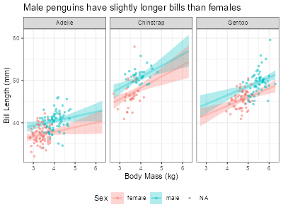

# Tweaking regressions with brms

```{r load penguin data}
#| echo: false
#| eval: true
library(ggplot2)
data(penguins)
penguins$body_mass_kg <- penguins$body_mass / 1000
```

## What do the numbers mean?

Let us return to our model for learning about the average penguin weight by
species:

```{r return to fit_peng1}
library(brms)
options(brms.backend = "cmdstanr")
fit_peng1 <- brm(
    formula = body_mass_kg ~ species,
    data = penguins
)
```

We now know that Bayesian models use clever math to draw a bunch of random values to describe the parameters of interest. The image below shows some colored histograms that represent the random draws---i.e., the posterior distributions---that `brms` got to describe each average penguin weight. The black dots are the estimated means of these histograms and the black bars around the black dots represent 95% *credibility* intervals of the average weights.

```{r peng1 posteriors}
#| code-fold: true
#| title: Posteriors of average weights
#| fig-align: center
#| fig-width: 3.9
#| fig-height: 3
library(tidybayes)
library(ggplot2)
# Create a reference grid with one row per species
species_grid <- data.frame(species = c("Adelie", "Chinstrap", "Gentoo"))
# Extract posterior draws of the mean (epred = expected prediction)
posterior_means <- add_epred_draws(species_grid, fit_peng1)
ggplot(posterior_means, aes(x = .epred, y = species, fill = species)) +
  stat_histinterval(breaks = 20, point_interval = "mean_qi", .width = 0.95) +
  scale_x_continuous(breaks = seq(3.4, 5.6, by = 0.2)) +
  labs(
    title = "Chinstrap and Gentoo have similar average\nweights",
    x = "Average weight (kilograms)",
    y = "Species"
  ) +
  theme_bw() +
  theme(legend.position = "none")
```

{fig-align="center" width=3.9in
height=3in}

Now let us revisit the model summary we saw before:

```
Family: gaussian
  Links: mu = identity
Formula: body_mass_kg ~ species
   Data: penguins (Number of observations: 342)
  Draws: 4 chains, each with iter = 2000; warmup = 1000; thin = 1;
         total post-warmup draws = 4000

Regression Coefficients:
                 Estimate Est.Error l-95% CI u-95% CI Rhat Bulk_ESS Tail_ESS
Intercept            3.70      0.04     3.63     3.77 1.00     3794     2739
speciesChinstrap     0.03      0.07    -0.10     0.17 1.00     3977     2723
speciesGentoo        1.38      0.06     1.27     1.49 1.00     3844     3151

Further Distributional Parameters:
      Estimate Est.Error l-95% CI u-95% CI Rhat Bulk_ESS Tail_ESS
sigma     0.46      0.02     0.43     0.50 1.00     3943     2698

Draws were sampled using sample(hmc). For each parameter, Bulk_ESS
and Tail_ESS are effective sample size measures, and Rhat is the potential
scale reduction factor on split chains (at convergence, Rhat = 1).
```

We are already familiar with Estimate, Est.Error, and l-95% CI and u-95% CI.
But other terms need elaboration, like chain, iter, warmup, Rhat, and Bulk_ESS
and Tail_ESS. The formal definitions of these terms are complicated (*very*
complicated), but an informal understanding is enough to fit almost all the
models we need.

The random draws we get form a sequence or **chain**. Also, to get each random
draw, `brms` goes through a computational process that it calls an
**iteration**. The first few draws are usually too inaccurate to be useful, so
we have to let the chain discard some **warmup** iterations.

Our penguin regression above used four chains, each of which had 2000
iterations---including warmup iterations, which we discard. Combining the
post-warmup draws from all four chains gives us 4000 useful draws in total.

For complicated mathematical reasons, draws from a given chain tend to be
related to each other, so they are not as informative as if they were
independent. The **effective sample size (ESS)** measures the equivalent
number of random draws we would have if our iterations were independent. A
higher ESS means more reliable estimates. **Bulk ESS** measures the reliability
of the center (or bulk) of our posterior distribution; the number we see in the
`Estimate` column. **Tail ESS** measures the reliability of the tails of the
posterior distribution; the numbers in columns `l-95% CI` and `u-95% CI`. So,
having both a high Bulk ESS and high Tail ESS suggest that our histograms as a
whole are reliable.

We want the effective sample size to be high enough to get stable estimates of
uncertainty. In practice, this means that the ESS for all parameters should be
above 400 in most models, or at least 100 for special parameters in
complicated models. Our penguin model above has way more ESS than this: the
lowest Bulk ESS is 3794 (for the `Intercept`) and the lowest Tail ESS is 2698
(for the standard deviation `sigma`).

Finally, our chain is supposed to get draws for all the relevant values of the
parameter of interest. However, with complicated models or difficult data,
a chain can get stuck in a few specific values, depriving us of an accurate
description of the posterior distribution. To check that we are getting all the
relevant values, we should check that multiple chains *converge* to the same
random values. In practice, we should use at least four chains when fitting any
model.

**R-hat** (often styled $\hat{R}$) diagnoses convergence by comparing the
variance of numbers within the chains to the variance across different chains.
If the chains converged, these two variances should be roughly the same, so
R-hat would equal 1. If the chains did not converge, the variances would
differ and R-hat would be higher than 1.

In practice, an R-hat above 1.01 signals convergence problems and, therefore,
unreliable results; an R-hat below 1.01 means that our chains converged well,
so our results are reliable. Our penguin model shows that the R-hat for all
parameters is practically 1. C'est magnifique!

## Turning knobs and pushing buttons

Our success in comparing penguins' weight by species has made us more curious
about these lovely amigos. Let us consider now, how much longer or shorter
are the bills of male penguins compared to female penguins on average? To
answer this question, we could fit a regression with bill length (in
milimiters) as the dependent variable and sex as the independent variable. But
bill length may be related to the size of the penguins, which in turn changes
by sex and species. So, to separate all these associations, we can add weight
to our regression as a proxy for size.

One way to visualize our model is below:

```{r plot bill length by sex and species}
#| code-fold: true
#| eval: true
#| warning: false
#| fig-align: center
#| fig-width: 5.5
#| fig-height: 3.8
ggplot(
  data = penguins,
  mapping = aes(x = body_mass_kg, y = bill_len, color = sex)
) +
  geom_point() +
  labs(title = "ASDGF", x = "Body mass (kg)", y = "Bill length (mm)") +
  theme_bw() +
  facet_wrap(~species, nrow = 1) +
  theme(legend.position = "bottom")
```

Since we now know about chains and iterations, we can change them to fit our
model more efficiently. By default, `brms` uses 4 chains, each with 2000 total
iterations of which half are for warmup. Our model for bill length is
relatively simple, so let's try saving some computer time by using fewer
iterations per chain. And let us be cool by having `brms` fit all the chains
in parallel rather than one after the other.

To make our model parameters easier to interpret, we will recenter weight
(`body_mass_kg`) around its overall mean of 4.2 kg.

```{r center covariates in bill_len_fit1}
#| eval: true
penguins$bm_kg_ctr <- penguins$body_mass_kg -
  mean(penguins$body_mass_kg, na.rm = TRUE)
```

<!--
During workshop, purposely start with too few iterations to illustrate problems
-->

```{r fit bill_len_fit1}
bill_len_fit1 <- brm(
  formula = bill_len ~ sex + species + bm_kg_ctr,
  data = penguins,
  chains = 4,
  cores = 4, # for running chains in parallel
  iter = 800, # short for "iterations per chain" (this includes warmup)
  warmup = 400 # must be lower than iter
)
```

In the code above, the argument `chains` controls how many separate sequences
of random values we will use. `warmup` controls how many random draws we will
discard at the beginning. `iter` (short for iterations) controls the
total number of random draws *per chain*, which includes the warmup. `cores`
controls the number of mini-brains in our computer that R will occupy. Each
chain runs in one core, so with four cores we can run four chains
simultaneously. We never need more cores than chains, but we may need to use
fewer cores if our computer is small or has little memory.

The regression summary (see below) shows that the effective sample sizes for
all parameters are well above the minimum threshold of 400, and all R-hats are
equal to 1. And since R did not show any errors or concerning warnings, we can
trust that our model ran appropriately.

```{r summary bill_len_fit1}
summary(bill_len_fit1)
```

```
Warning message:
Rows containing NAs were excluded from the model.
 Family: gaussian
  Links: mu = identity
Formula: bill_len ~ sex + bm_kg_ctr
   Data: penguins (Number of observations: 333)
  Draws: 4 chains, each with iter = 800; warmup = 400; thin = 1;
         total post-warmup draws = 1600

Regression Coefficients:
          Estimate Est.Error l-95% CI u-95% CI Rhat Bulk_ESS Tail_ESS
Intercept    43.35      0.36    42.66    44.07 1.00     1584     1306
sexmale       1.26      0.55     0.20     2.33 1.00     1628     1183
bm_kg_ctr     3.67      0.33     3.03     4.33 1.00     1428     1021

Further Distributional Parameters:
      Estimate Est.Error l-95% CI u-95% CI Rhat Bulk_ESS Tail_ESS
sigma     4.41      0.17     4.09     4.76 1.00     1623     1215

Draws were sampled using sample(hmc). For each parameter, Bulk_ESS
and Tail_ESS are effective sample size measures, and Rhat is the potential
scale reduction factor on split chains (at convergence, Rhat = 1).
```

Interpreting the regression coefficients is a bit more difficult now that we
have two explanatory variables, one categorical and one numerical. It is
easier to plot the results using a few convenient libraries. First we define
the coordinates that we want to see, then we ask the model for its inferences
at these coordinates, and then we ask R to paint a plot with these results.

`expand.grid()` can build a data frame with the coordinates we want to plot
results for. We fill this function with the names and values of the variables
we want to get. `expand.grid()` will then create all possible combinations
of the values of these variables. The code to do this is shown below.

```{r grid of values for sex and species}
pred_grid <- expand.grid(
  sex = levels(penguins$sex),
  species = levels(penguins$species),
  bm_kg_ctr = seq(
    min(penguins$bm_kg_ctr, na.rm = TRUE),
    max(penguins$bm_kg_ctr, na.rm = TRUE),
    length.out = 50
  )
)
head(pred_grid)
```


Now we can combine the results from our model `bill_len_fit1` with the values
in `pred_grid` to paint regression values at these coordinates.
`add_epred_draws()` fills our regression many times, each time with a different
draw we got from `brm()`. Then, `add_epred_draws()` computes the average of our
dependent variable (bill length) based on all these regression draws. Finally,
all these results are arranged in a format that is easy to plot with `ggplot`
and other libraries. Luckily, the code to execute this rather involved process
is blissfully simple:

```{r}
library(tidybayes)
posterior_lines <- add_epred_draws(
  newdata = pred_grid,
  object = bill_len_fit1,
  ndraws = 800
)
```

We can read the code above as "for each point of interest in `pred_grid`, we
want `ndraws` draws from `bill_len_fit1`". Omitting `ndraws` will ask
`add_epred_draws` to use all available draws in `bill_len_fit1`. Using more
draws increases the precision of the plots we paint, but also the time it
takes to draw them. I have found that 600 draws are precise and fast enough
to analyze my data, and only use all the draws when presenting the final
results of an analysis.

Finally, we can combine `ggplot` with the `stat_lineribbon()` function from
the `tidybayes` library. `stat_lineribbon()` takes all the regression draws we
saved in `posterior_lines` and, with some trickery, transforms them into a smooth plot. The thick lines represents the point estimates and the shaded regions represent the credibility intervals of the average bill length at each
weight.


```{r plot results from bill_len_fit1}
# Save mean to return body mass to de-center body mass.
bm_kg_mean <- mean(penguins$body_mass_kg, na.rm = TRUE)
ggplot(
  data = posterior_lines,
  mapping = aes(x = bm_kg_ctr + bm_kg_mean, y = .epred, color = sex, fill = sex)
) +
  stat_lineribbon(.width = 0.95, alpha = 0.3) +
  # Add observed data to plots
  geom_point(
    data = penguins,
    aes(x = bm_kg_ctr + bm_kg_mean, y = bill_len),
    alpha = 0.5,
    size = 1
  ) +
  facet_wrap(~species) +
  labs(
    title = "Male penguins have slightly longer bills than females",
    x = "Body Mass (kg)",
    y = "Bill Length (mm)",
    color = "Sex",
    fill = "Sex"
  ) +
  theme_bw() +
  theme(legend.position = "bottom")
```

{#fig-bill-reg fig-align="center" width=600}

So, if we took two penguins of the same weight and species, we would expect
the male penguin to have a bill 1.26 mm longer than the female penguin.