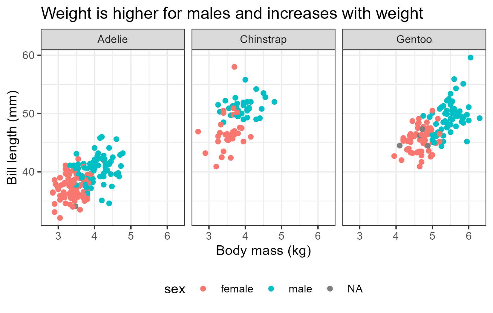
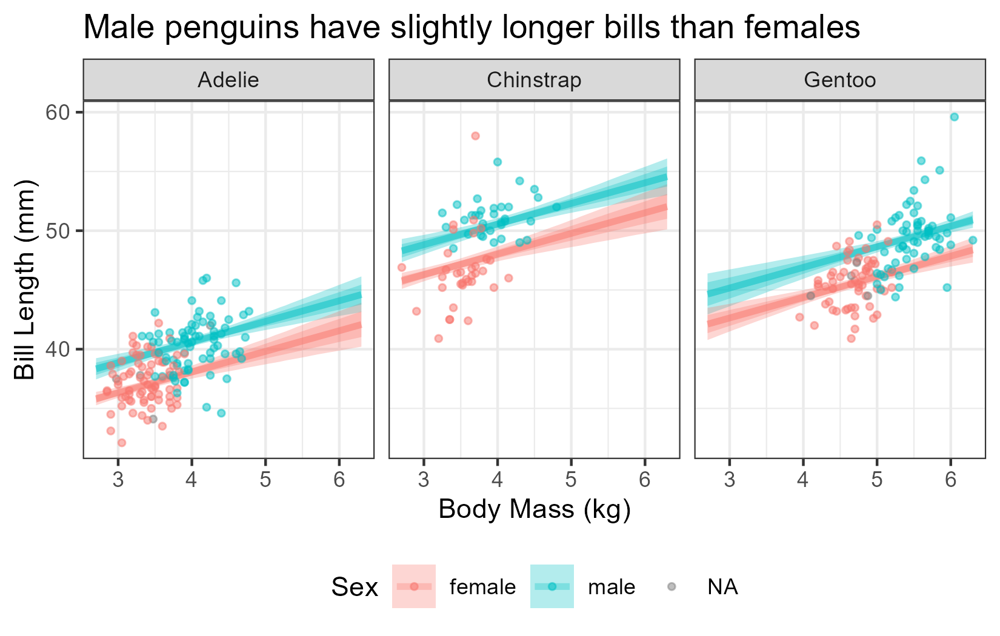

# Tweaking regressions with brms

```{r Load libraries and data}
#| code-summary: "Load libraries and data"
#| code-fold: true
#| output: false
library(ggplot2)
library(brms)
library(tidybayes)
options(brms.backend = "cmdstanr")
data(penguins)
penguins$body_mass_kg <- penguins$body_mass / 1000
```

## What do the numbers mean?

Let us return to our model for learning about the average penguin weight by
species:

```{r return to fit_weight1}
fit_weight1 <- brm(
    formula = body_mass_kg ~ species,
    data = penguins
)
```

We now know that Bayesian models use clever math to draw a bunch of random
values to describe the parameters of interest. The image below shows some
colored histograms that represent the random draws---i.e., the posterior
distributions---that `brms` got to describe each average penguin weight. The
black dots are the estimated means of these histograms and the black bars
around the black dots represent 95% *credibility* intervals of the average
weights.

```{r peng1 posteriors}
#| code-fold: true
#| title: Posteriors of average weights
#| fig-align: center
#| fig-width: 3.9
#| fig-height: 3
# Create a reference grid with one row per species
species_grid <- data.frame(species = c("Adelie", "Chinstrap", "Gentoo"))
# Extract posterior draws of the mean (epred = expected prediction)
posterior_means <- add_epred_draws(species_grid, fit_weight1)
ggplot(posterior_means, aes(x = .epred, y = species, fill = species)) +
  stat_histinterval(breaks = 20, point_interval = "mean_qi", .width = 0.95) +
  scale_x_continuous(breaks = seq(3.4, 5.6, by = 0.2)) +
  labs(
    title = "Chinstrap and Gentoo have similar average\nweights",
    x = "Average weight (kilograms)",
    y = "Species"
  ) +
  theme_bw() +
  theme(legend.position = "none")
```

[{#fig-post-peng1 fig-align="center" width=3.9in height=3in}](./images/post-dist-peng1.png)

Now let us revisit the model summary we saw before:

```
Family: gaussian
  Links: mu = identity
Formula: body_mass_kg ~ species
   Data: penguins (Number of observations: 342)
  Draws: 4 chains, each with iter = 2000; warmup = 1000; thin = 1;
         total post-warmup draws = 4000

Regression Coefficients:
                 Estimate Est.Error l-95% CI u-95% CI Rhat Bulk_ESS Tail_ESS
Intercept            3.70      0.04     3.63     3.77 1.00     3794     2739
speciesChinstrap     0.03      0.07    -0.10     0.17 1.00     3977     2723
speciesGentoo        1.38      0.06     1.27     1.49 1.00     3844     3151

Further Distributional Parameters:
      Estimate Est.Error l-95% CI u-95% CI Rhat Bulk_ESS Tail_ESS
sigma     0.46      0.02     0.43     0.50 1.00     3943     2698

Draws were sampled using sample(hmc). For each parameter, Bulk_ESS
and Tail_ESS are effective sample size measures, and Rhat is the potential
scale reduction factor on split chains (at convergence, Rhat = 1).
```

The numerical summaries we met before have enriched their meaning: they capture
different parts of the histograms in @fig-post-peng1. `Estimate` shows their
mean (painted as black dots), `Est.Error` shows their standard errors, and
l-95% CI and u-95% CI show their 5% and 95% quantiles of the histograms
(painted as black bars).

Other terms in the summary need elaboration, like chain, iter, warmup, Rhat,
and Bulk_ESS and Tail_ESS. The formal definitions of these terms are *very*
complicated, but an informal understanding is enough to fit almost all the
models we need.

The random draws we get form a sequence or **chain**. Also, to get each random
draw, `brms` goes through a computational process that it calls an
**iteration**. The first few draws are usually too inaccurate to be useful, so
we have to let the chain discard some **warmup** iterations.

Our penguin regression above used four chains, each of which had 2000
iterations---including warmup iterations, which we discard. Combining the
post-warmup draws from all four chains gives us 4000 useful draws in total.

For complicated mathematical reasons, draws from a given chain tend to be
related to each other, which makes them less informative than if they were
independent. The **effective sample size (ESS)** measures the equivalent
number of random draws we would have if our iterations were independent. A
higher ESS means more reliable estimates. **Bulk ESS** measures the
reliability of the center (or bulk) of our posterior distribution, e.g., the
number we see in the `Estimate` column. **Tail ESS** measures the reliability
of the tails of the posterior distribution, e.g., the numbers in columns
`l-95% CI` and `u-95% CI`. So, having both a high Bulk ESS and high Tail ESS
suggest that our histograms as a whole are reliable.

We want the effective sample size to be high enough to get stable estimates of
uncertainty. In practice, this means that the ESS for all parameters should be
above 400 in most models (see @Vehtari_2021), or at least 100 for special
parameters in complicated models. Our penguin model above has way more ESS than
this: the lowest Bulk ESS is 3794 (for the `Intercept`) and the lowest Tail ESS
is 2698 (for the standard deviation `sigma`).

Finally, our chain is supposed to get draws for all the relevant values of the
parameter of interest. However, with complicated models or difficult data,
a chain can get stuck in a few specific values, depriving us of an accurate
description of the posterior distribution. To check that we are getting all the
relevant values, we should check that multiple chains *converge* to the same
random values. In practice, we should use at least four chains when fitting any
model.

**R-hat** (often styled $\hat{R}$) diagnoses convergence by comparing the
variance of numbers within the chains to the variance across different chains.
If the chains converged, these two variances should be roughly the same, so
R-hat would equal 1. If the chains did not converge, the variances would
differ and R-hat would be higher than 1.

In practice, an R-hat above 1.01 signals convergence problems and, therefore,
unreliable results; an R-hat below 1.01 means that our chains converged well,
so our results are reliable (see @Vehtari_2021). Our penguin model shows that
the R-hat for all parameters is practically 1. C'est magnifique!

## The missing ingredient

So far, we have neglected the third ingredient of Bayesian cuisine: the prior
distribution. A prior distribution describes what we know about the model
parameters *before*, or *prior to*, analyzing our current data. This prior
knowledge always exists and may come from previously published papers, related
experiments, a formal theory, an informal familiarity, and sometimes from what
we could call plain common sense. So, we can use the prior distribution to
condense previous empirical work or to disregard implausible behaviors or
relationships.

All Bayesian models have priors for all the parameters involved. `brms` has
default priors that cover wide ranges of values. Especially so for regression
parameters (excluding the intercept), which get assigned "flat" priors that, in
rough terms, think that all real numbers are equally plausible. In our model
above, for example, a flat prior for `speciesGentoo` says that, before seeing
the data, we think that Gentoo penguins may be bigger than elephants or smaller
than fleas.

Even a morsel of knowledge can lead to better priors than the defaults. Let's
pretend we have not yet fitted a regression. [Wikipedia says](https://en.wikipedia.org/wiki/Ad%C3%A9lie_penguin#Description)
that Adelie penguins weigh between 3.8 and 8.2 kg;
[that](https://en.wikipedia.org/wiki/Chinstrap_penguin#Description)
Chinstrap penguins weigh between 3.2 and 5.3 kg;
[and that](https://en.wikipedia.org/wiki/Gentoo_penguin#Description) Gentoo
penguins weigh between 4.5 and 8.5 kg.

This knowledge suggests choosing our priors so that all *average* weights are
between 4 and 8 kg; and so that most weights are within 1 or 2 kg of their
averages. We also allow the possibility of abnormally fat or thin penguins by
using a special prior (see below). Note that Wikipedia was talking about the
full ranges of weights, not just averages, so our priors are comparatively
broad.

One way of defining our model's priors is with the `prior()` function. The
first, and unnamed, argument in `prior()` is the distribution[^avail-dist] we
want to use. The second argument, `class`, is the type of parameter this
distribution applies to. `prior()` accepts optional arguments `lb` and `ub` to
implement hard limits on the parameter of interest. Use `lb` and `ub` only with
parameters that have mathematical boundaries; standard deviations, for example,
cannot be negative.

[^avail-dist]: The list of available distributions and their parametrizations
is available at <https://mc-stan.org/docs/functions-reference/unbounded_continuous_distributions.html>

In this regression, we have to define three separate priors: one for the
Intercept, one to apply to all other regression coefficients (nicknamed `b` in
`brms` code), and one for the standard deviation of regression residuals
(nicknamed `sigma`). The code to do this is shown below.

```{r priors for weight1}
priors_weight1 <- prior(normal(6, 1), class = "Intercept") +
  prior(normal(0, 1), class = "b") +
  prior(normal(0, 2), class = "sigma", lb = 0)
```

Now we refit our model with these new priors.

```{r fit weight model with priors}
fit_weight2 <- brm(
    formula = body_mass_kg ~ species,
    data = penguins,
    prior = priors_weight1
)
summary(fit_weight2)
```

```
 Family: gaussian
  Links: mu = identity
Formula: body_mass_kg ~ species
   Data: penguins (Number of observations: 342)
  Draws: 4 chains, each with iter = 2000; warmup = 1000; thin = 1;
         total post-warmup draws = 4000

Regression Coefficients:
                 Estimate Est.Error l-95% CI u-95% CI Rhat Bulk_ESS Tail_ESS
Intercept            3.70      0.04     3.63     3.78 1.00     3775     3195
speciesChinstrap     0.03      0.07    -0.11     0.16 1.00     3736     2989
speciesGentoo        1.37      0.06     1.26     1.48 1.00     3684     3021

Further Distributional Parameters:
      Estimate Est.Error l-95% CI u-95% CI Rhat Bulk_ESS Tail_ESS
sigma     0.46      0.02     0.43     0.50 1.00     4175     3037

Draws were sampled using sample(hmc). For each parameter, Bulk_ESS
and Tail_ESS are effective sample size measures, and Rhat is the potential
scale reduction factor on split chains (at convergence, Rhat = 1).
```

Our new results are very similar to the ones we had obtained using the default
priors. In part because our data have enough evidence to avoid elephantine
inferences. And in part because our Wikipedia-based priors overlapped with our
data.


## Turning knobs and pushing buttons

Our success in comparing penguins' weight by species has made us more curious
about these lovely amigos. Let us consider now, how much longer or shorter
are the bills of male penguins compared to female penguins on average? Before
we fit a regression, consider that bill length may be related to the size of
the penguins, which in turn changes by sex and species. We can visualize these
associations below:

```{r plot bill length by sex and species}
#| code-fold: true
#| warning: false
#| fig-align: center
#| fig-width: 5.5
#| fig-height: 3.5
ggplot(
  data = penguins,
  mapping = aes(x = body_mass_kg, y = bill_len, color = sex)
) +
  geom_point() +
  labs(
    title = "Weight is higher for males and increases with weight",
    x = "Body mass (kg)",
    y = "Bill length (mm)"
  ) +
  theme_bw() +
  facet_wrap(~species, nrow = 1) +
  theme(legend.position = "bottom")
```

[{#fig-bill-len-assocs fig-align="center" width=5.5in}](./images/bill-len-assocs.png)

We could fit a regression with bill length (in milimiters) as the dependent
variable, using sex as the independent variable and adding weight as a proxy
for size. To make our model parameters easier to interpret, we will recenter
weight (`body_mass_kg`) around its overall mean of 4.2 kg.

```{r center covariates in fit_bill_len1}
penguins$bm_kg_ctr <- penguins$body_mass_kg -
  mean(penguins$body_mass_kg, na.rm = TRUE)
```

To set our priors, note that the `Intercept` in `brms` represents the average
value of the dependent variable when all independent variables are set to their
average or to the reference category. With this in mind, we think that female
Adelie penguins of average weight have a bill length of around 45 mm, and that
bills of other types of penguins will be within 10 or 20 mm of this intercept.
We also assign a more specific prior for the weight variable because we think
it has a special association with bill length. To do this, we add a separate
call of `prior()` and add the `coef` argument to specify the name of the
variable.

```{r priors for fit_bill_len1}
priors_bill_len1 <- prior(normal(45, 10), class = "Intercept") +
  prior(normal(0, 10), class = "b") +
  prior(normal(0, 4), class = "b", coef = "bm_kg_ctr") +
  prior(normal(0, 20), class = "sigma", lb = 0)
```

We can fit our model more efficiently by changing the number of chains and
iterations. By default, `brms` uses 4 chains, each with 2000 total iterations
of which half are for warmup. Our model for bill length is relatively simple,
so let's try saving some computer time by using fewer iterations per chain. And
let us be cool by having `brms` fit all the chains in parallel rather than one
after the other.

<!--
During workshop, purposely start with too few iterations to illustrate problems
-->

```{r fit fit_bill_len1}
fit_bill_len1 <- brm(
  formula = bill_len ~ sex + species + bm_kg_ctr,
  data = penguins,
  prior = priors_bill_len1,
  chains = 4,
  cores = 4, # for running chains in parallel
  iter = 800, # short for "iterations per chain" (this includes warmup)
  warmup = 400 # must be lower than iter
)
```

In the code above, the argument `chains` controls how many separate sequences
of random values we will use. `warmup` controls how many random draws we will
discard at the beginning. `iter` (short for iterations) controls the
total number of random draws *per chain*, which includes the warmup. `cores`
controls the number of mini-brains in our computer that R will occupy. Each
chain runs in one core, so with four cores we can run four chains
simultaneously. We never need more cores than chains, and we can not use more
cores than our computer has available. In practice, ask for at most one core
less than those available in your computer; the extra core will run everything
else (e.g., internet browsers or Excel).

The regression summary below shows that the effective sample sizes for
all parameters are well above the minimum threshold of 400, and all R-hats are
equal to 1. And since R did not show any errors or concerning warnings, we can
trust that our model ran appropriately.

```{r summary fit_bill_len1}
summary(fit_bill_len1)
```

```
Family: gaussian
  Links: mu = identity
Formula: bill_len ~ sex + species + bm_kg_ctr
   Data: penguins (Number of observations: 333)
  Draws: 4 chains, each with iter = 800; warmup = 400; thin = 1;
         total post-warmup draws = 1600

Regression Coefficients:
                 Estimate Est.Error l-95% CI u-95% CI Rhat Bulk_ESS Tail_ESS
Intercept           38.43      0.39    37.64    39.18 1.00      932     1011
sexmale              2.53      0.36     1.85     3.26 1.00      932     1004
speciesChinstrap     9.96      0.34     9.30    10.63 1.00     1633     1036
speciesGentoo        6.29      0.61     5.13     7.48 1.00      956     1134
bm_kg_ctr            1.73      0.39     0.95     2.49 1.00      897     1063

Further Distributional Parameters:
      Estimate Est.Error l-95% CI u-95% CI Rhat Bulk_ESS Tail_ESS
sigma     2.27      0.09     2.10     2.45 1.00     1226      881

Draws were sampled using sample(hmc). For each parameter, Bulk_ESS
and Tail_ESS are effective sample size measures, and Rhat is the potential
scale reduction factor on split chains (at convergence, Rhat = 1).
```

The coefficient for `sexmale` tells us that, if we took two penguins of the
same species and average weight, we would expect the male penguin to have a
bill that is between 1.85 and 3.22 mm longer on average than the female
penguin.

A plot will help us visualize other regression results. First we define the
coordinates that we want to see. `expand.grid()` can build a data frame with
the coordinates we want to plot results for. We fill this function with the
names and values of the variables we want to get. `expand.grid()` will then
create all possible combinations of the values of these variables.

```{r grid of values for sex and species}
pred_grid <- expand.grid(
  sex = levels(penguins$sex),
  species = levels(penguins$species),
  bm_kg_ctr = seq(
    min(penguins$bm_kg_ctr, na.rm = TRUE),
    max(penguins$bm_kg_ctr, na.rm = TRUE),
    length.out = 50
  )
)
head(pred_grid)
```
```
     sex   species bm_kg_ctr
1 female    Adelie -1.501754
2   male    Adelie -1.501754
3 female Chinstrap -1.501754
4   male Chinstrap -1.501754
5 female    Gentoo -1.501754
6   male    Gentoo -1.501754
```

Now we can combine the results from our model `fit_bill_len1` with the values
in `pred_grid` to paint regression values at these coordinates.
`add_epred_draws()` uses the draws we got from `brm()` to compute many
plausible averages of our dependent variable (bill length) many times. Finally,
all these results are arranged in a format that is easy to plot with `ggplot`
and other libraries. Luckily, the code to execute this rather involved process
is blissfully simple:

```{r}
posterior_lines <- add_epred_draws(
  newdata = pred_grid,
  object = fit_bill_len1
)
```

We can read the code above as "for each point of interest in `pred_grid`, we
want `ndraws` draws from `fit_bill_len1`". Omitting `ndraws` will ask
`add_epred_draws()` to use all available draws in `fit_bill_len1`. Using more
draws increases the precision of the plots we paint, but also the time it
takes to draw them. 600 draws are usually precise and fast enough to plot and
summarize results; we can use all the draws only when presenting the final
results of an analysis.

Finally, we can combine `ggplot` with the `tidybayes` library to create a plot.
`stat_lineribbon()` takes all the regression draws we saved in
`posterior_lines` and, with some trickery, transforms them into a smooth plot.
The thick lines represent the means and the shaded regions represent the
credibility intervals of the average bill length at each weight.


```{r plot results from fit_bill_len1}
#| warning: false
#| fig-align: center
#| fig-width: 5.5
#| fig-height: 3.5
# Save mean to return body mass to de-center body mass.
bm_kg_mean <- mean(penguins$body_mass_kg, na.rm = TRUE)
ggplot(
  data = posterior_lines,
  mapping = aes(
    x = bm_kg_ctr + bm_kg_mean,
    y = .epred,
    color = sex,
    fill = sex
  )
) +
  stat_lineribbon(
    point_interval = "mean_qi",
    .width = c(0.66, 0.9),
    alpha = 0.3
  ) +
  facet_wrap(~species) +
  labs(
    title = "Male penguins have slightly longer bills than females",
    x = "Body Mass (kg)",
    y = "Bill Length (mm)",
    color = "Sex",
    fill = "Sex"
  ) +
  theme_bw() +
  theme(legend.position = "bottom") +
  # OPTIONAL: Add observed data to plots
  geom_point(
    data = penguins,
    aes(x = bm_kg_ctr + bm_kg_mean, y = bill_len),
    alpha = 0.5,
    size = 1
  )
```

[{#fig-bill-len1-regline fig-align="center" width=5.5in}](./images/bill-len1-regline.png)

In `stat_lineribbon()`, `point_interval` controls the type of estimates that
the plot will show, with `"mean_qi"` referring to using a mean and quantiles
for the credibility intervals. `.width` controls the quantiles we use to
delineate the credibility intervals. Using `c(0.66, 0.9)` uses quantiles for
66% and 90% credibility.